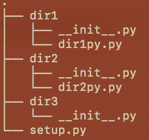
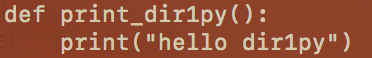
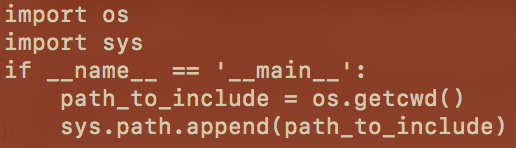
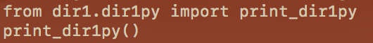

### These notes show how to structure directories and have essential building blocks for developing a python package

1. insert and append methods are not specific to sys.path and as in other languages they add an item into a list or array and 


- append(item) add item to the end of the list

- insert(n, item) inserts the item at the nth position in the list (0 at the beginning, 1 after the first element, etc ...)

2. Python search the import files in each directory of the path in the order of the path, so :

- If you have no file name collisions, the order of the path has no impact,

- If you look after a function already defined in the path and you use append to add your path, you will not get your function but the predefined one.

But I think that it is better to use append and not insert to not overload the standard behavior of Python, and use non-ambiguous names for your files and methods.

Inside test_package directory

dir1py.py

Note:

1. To access dir1 modules from inside of dir2 or dir3, we need to have \_\_init\_\_.py (empty) file in dir1 directory. Similarly we should have empty \_\_init\_\_.py file in every directory of the package that has any *.py modules.

2. sys.path should contain absolute path to the package test_package directory that has dir1 (for example) as module. So in the setup.py file

3. When you use this package, get a condo environment. Install all necessary packages from requirements.txt or environment.yml file and run the setup.py file

4. Then carry your analysis from any *.py from any folder and you can import modules and functions from dir2py.py as

